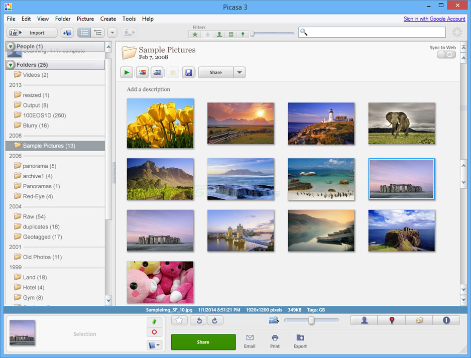

# Picasa 3.9 Snap

This is the snap for [Picasa](https://picasa.google.com/). Google's photo organizer that was discontinued in 2016. It features easy to use picture management with automatic face recognition. Albeit unsupported, it still works fine on modern systems.

This Windows application runs on Linux using the Wine compatibility layer. For that reason, it may not function as expected. If you encounter issues please report in the issue tracker of this repository.



## Install

```shell
snap install picasasnap
```

([Don't have snapd installed?](https://snapcraft.io/docs/core/install))


## Reusing this snap

You can use this snap as a reference for creating snaps of other Windows applications. See the [sommelier-core](https://github.com/snapcrafters/sommelier-core) repo for more information on how to snap a Windows application.

If you have any questions about creating snaps of Windows applications then [post in the Snapcraft forum](https://forum.snapcraft.io).

## License

This snap manifest is released under the GPLv2 license. Picasa itself is a proprietary application owned by Google.
